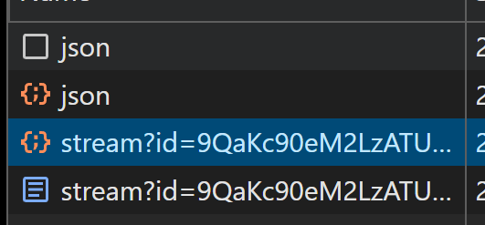
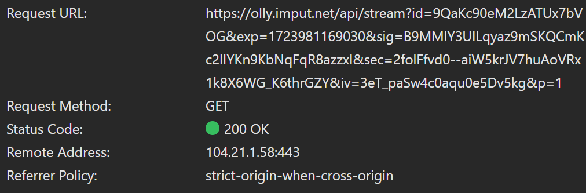
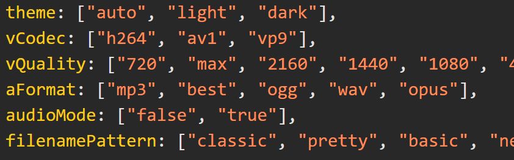

<!-- PROJECT LOGO -->

<div align="center">


<h1 align="center" style="font-size: 40px">YT Monk</h1>


  <p align="center">
    A YouTube video and playlist downloader made in Python.
    <br />
    <br />
    <a href="https://github.com/vojtikDortik/yt-monk/issues/new?labels=bug&template=bug-report---.md">Report Bug</a>
    ·
    <a href="https://github.com/vojtikDortik/yt-monk/issues/new?labels=enhancement&template=feature-request---.md">Request Feature</a>
  </p>
</div>


<!-- TABLE OF CONTENTS -->
<details>
  <summary>Table of Contents</summary>
  <ol>
    <li>
      <a href="important">Important</a>
    </li>
    <li>
      <a href="#about-the-project">About The Project</a>
    </li>
    <li>
      <a href="#getting-started">Getting Started</a>
    </li>
    <li><a href="#usage">Usage</a></li>
    <li><a href="#license">License</a></li>
  </ol>
</details>

## Important

This is my first project uploaded to Github. If you find a mistake or just anything you don't like, just let me know and I'll try to fix it.

<!-- ABOUT THE PROJECT -->
## About The Project

This little project began when I wanted to download a playlist from YouTube. For downloading single videos, I always use [cobalt.tools](https://cobalt.tools), because it is ad-free and open-source, but it is still missing something... a playlist downloader. I tried a few other YT downloaders to download a playlist, but I wasn't happy with their functionality. 


([cobalt](https://cobalt.tools) website)

So I decided to make my own YT video and playlist downloader in Python.

### Making the program
First, I downloaded a [testing video](https://www.youtube.com/watch?v=9bZkp7q19f0) and captured the network traffic from [cobalt](https://cobalt.tools), because I wanted to know how do they download videos:




(the network traffic capture)

Based on that capture, I found out, that the user recieves the video as a stream of data from `olly.imput.net/api`. Now I need to know how to make the request to their API to get the stream URL, so I looked into the JavaScript code, that was downloading the videos:




(JavaScript code of the website)

Now that I know how to get the stream URL, I can recreate it in python:
```python
response = json.loads(requests.post(self.api_url, headers=headers, data=json.dumps(data)).text)
if response['status'] == 'stream':
  stream_url = response['url']
```
And capture the stream to a file:

```python
def captureStream(self, stream_url, file_path):
  with requests.get(stream_url, stream=True) as r:
    r.raise_for_status()
      with open(file_path, 'wb') as f:
        for chunk in r.iter_content(chunk_size=8192):
          f.write(chunk)
```


Then I just made some more functions and it was done.


<!-- GETTING STARTED -->
## Getting Started

Now I'll show you how to use my code as an application and also as a python library.

### Getting the app

1. Clone the repo:

    ```sh
    git clone https://github.com/vojtikDortik/yt-monk.git
    ```

2. Install required libraries:

    ```sh
    pip install -r requirements.txt
    ```

3. Edit the `options.json` file. (you can leave it on the default options)


### Getting the library

1. Download these three files:

    * `ytMonk.py`
    * `options.json`
    * `requirements.txt`

2. Install required libraries:

    ```sh
    pip install -r requirements.txt
    ```

3. Edit the `options.json` file. (you can leave it on the default options)


<!-- USAGE EXAMPLES -->
## Usage
Here are some basic examples of using my code

### Using as an application
When you run the `ytMonk.py` file
  ```sh
  python ytMonk.py
  ```

you will get prompted to enter the URL

```
Enter video URL (q to quit): 
```

You can enter video or playlist URL (the program will detect the URL type) or `q` to quit the loop.

### Using as a Python library

Import the library and define the `downloader` object:
```python
import ytMonk

downloader = ytMonk.YT_Downloader()
```

Downloading a video:


```python
video_url = 'https://www.youtube.com/watch?v=9bZkp7q19f0' 

downloader.downloadVideo(video_url)
```

Downloading a playlist:

```python
playlist_url = 'https://www.youtube.com/playlist?list=PL2_OBreMn7FrDzinpFROg9vwc9FI_F6ev' 

downloader.downloadPlaylist(playlist_url)
```


<!-- LICENSE -->
## License

Distributed under the MIT License. See `LICENSE.txt` for more information.


